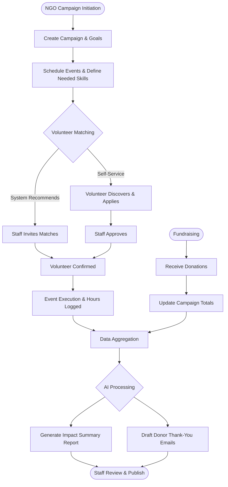
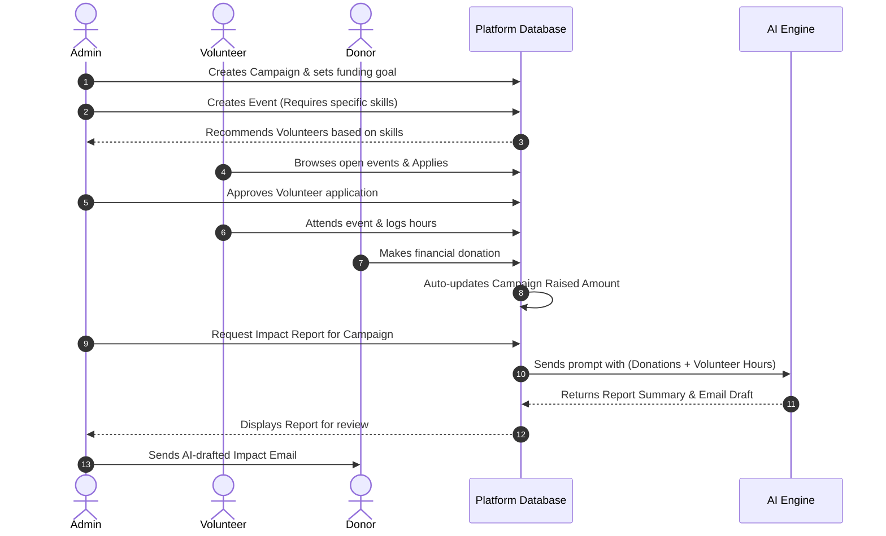

# NGO Management Platform: Full-Fledged Pitch Deck

This presentation outlines the complete, long-term vision for our NGO Management Platform.

---

## 1. Problem Statement
**The Challenge of Fragmented Operations in the Non-Profit Sector**

Currently, most mid-sized NGOs operate in a state of digital chaos:
*   **Disconnected Tools:** They use Excel for donor tracking, WhatsApp for volunteer coordination, and disparate email clients for communications.
*   **Data Silos & Admin Burden:** Staff spend hours manually cross-referencing spreadsheets instead of focusing on their core mission.
*   **Donor Attrition:** Without clear, timely visibility into how their money is being used and the impact it generates, donors lose interest and stop giving.
*   **Volunteer Friction:** Volunteers face a clunky onboarding process with no central place to discover events, apply, or track their contributed hours.

---

## 2. Expected Outcome / Proposed Solution
**A Centralized, AI-Powered Operating System for NGOs**

**The Solution:** A unified B2B SaaS platform that brings Donor Management, Volunteer Coordination, and Campaign Tracking under one roof.

**How it solves the problem:**
1.  **Replaces Spreadsheets:** By centralizing operations, staff have a single source of truth for all data.
2.  **Empowers Volunteers:** A self-service portal removes the administrative bottleneck of onboarding and scheduling volunteers.
3.  **Proves Impact to Donors:** An AI-powered reporting engine automatically translates raw operational data into compelling summaries, keeping donors engaged and increasing repeat donations.

---

## 3. Platform Features (What We Are Building)

The full-fledged platform is divided into two main portals, plus platform-wide capabilities:

### A. Admin & Staff Operations Portal
*   **Donor CRM & Financials:** Track donor profiles, record online/offline donations, flag recurring donors, and automatically update campaign funding totals.
*   **Campaign & Event Management:** Create fundraising campaigns with specific goals. Schedule events attached to those campaigns, defining location, dates, and required volunteer skills.
*   **AI-Powered Volunteer Recommendation System:** Intelligently select and recommend volunteers for specific events based on their logged skills, past attendance, and availability.
*   **Volunteer Coordination:** Review volunteer applications for events (approve/reject), track attendance, and manage a directory of all registered volunteers.
*   **Analytics Dashboard:** Visual charts showing donation trends, campaign progress, total volunteer hours, and flagged lapsed donors. Includes CSV data export.
*   **Communication Center:** Broadcast emails/SMS to donors (e.g., tax receipts) or volunteers (e.g., event reminders).

### B. Volunteer Self-Service Portal
*   **Profile Management:** Volunteers create accounts, input their skills (e.g., medical, logistics), set their availability, and update their location.
*   **Event Discovery & Application:** A searchable feed of upcoming events. Volunteers can filter by cause or required skills and apply with a single click.
*   **Personal Dashboard:** Volunteers can track their application statuses (pending, approved, rejected), view upcoming shifts, and see their lifetime "hours logged" for personal or academic credit.

### C. The Differentiator: AI Impact Report Generator
*   With one click, the system pulls live data from a campaign (dollars raised, number of volunteers, hours worked) and uses AI to generate an impact report summary and a personalized thank-you email draft for donors.

---

## 4. Workflows & Process Diagrams

### A. High-Level Process Diagram
*This flowchart maps the operational lifecycle within the platform.*

### B. Core Workflow (Sequence Diagram)
*This diagram illustrates how data flows between the Admin, Volunteer, Donor, and the AI Engine over time.*

---

## 5. Technologies & Tools
*This represents the enterprise-grade stack for the final product.*

*   **Frontend (User Interface):** Next.js (React Framework, App Router), Tailwind CSS for responsive design, Recharts for analytics dashboards.
*   **Backend (API & Logic):** Python with FastAPI (high performance, asynchronous).
*   **Database & Hosting:** Supabase (utilizing its free tier for PostgreSQL database hosting, authentication, and backend-as-a-service features).
*   **AI Integration:** NVIDIA NIM API (running advanced LLMs like Llama-3) to power the AI Impact Report Generator.
*   **Payments:** Stripe API for processing online donations.
*   **Communications:** Resend or SendGrid API for transactional emails and newsletters.
*   **Infrastructure:** Vercel for global frontend edge delivery.

---

## 6. Core Algorithms
The platform relies on two primary algorithmic approaches to drive its standout features:

1.  **AI Impact Report Generator (Large Language Models):**
    *   Utilizes a **Generative LLM (via NVIDIA NIM)** for dynamic summarization.
    *   The backend aggregates structured quantitative data (e.g., total dollars raised, total hours logged, number of distinct volunteers).
    *   This data is dynamically injected into a strictly engineered prompt that instructs the LLM to output a two-paragraph impact summary report and a personalized donor email, transforming raw metrics into readable summaries.
2.  **Volunteer Recommendation System (Jaccard Similarity & Content-Based Filtering):**
    *   Utilizes a **Jaccard Similarity Algorithm** to calculate the mathematical overlap between an event's required skills and a volunteer's profile skills.
    *   When an Admin creates an event, the system queries the volunteer database, scoring volunteers based on this skill intersection, geographic proximity, and past reliability (attendance rate). The highest-scoring volunteers are automatically surfaced as recommended candidates.

---

## 7. Challenges & Core Focus Areas

*   **Trust & Data Security:** NGOs handle sensitive donor, volunteer, and financial data, requiring strong authentication, encryption, access controls, audit logs, and secure multi-tenant data isolation.
*   **Payment Complexity:** Supporting online donations introduces challenges around payment processing, transaction fees, refunds, recurring donations, tax receipts, and multi-currency transactions.
*   **Scalability:** As more NGOs and users join the platform, the system must efficiently handle growing volumes of users, donations, events, and analytics while maintaining performance and strict data isolation.

---

## 8. Business Strategy: Monetization (How We Make Money)

**The Key Positioning:** "Free for core NGO operations → Pay when operational scale increases → Custom solutions for complex organizations."

### 1. Free
*For small NGOs and community organizations*
*   Donor management
*   Volunteer management
*   Campaign & event management
*   Basic dashboard
*   Event discovery & applications

### 2. Organization — Single NGO
*Everything in Free, plus:*
*   Bulk Email & Communication
*   Advanced Reports & Analytics
*   AI-Powered Recommendations
*   Previous data integration (Data migration tools)

### 3. Enterprise — Custom
*For large NGOs, foundations & NGO networks*
*   Everything in Organization
*   Multi-Branch / Multi-Location Support
*   Custom Workflows
*   Custom Features & Integrations
*   Advanced Roles & Permissions
*   Custom Branding
*   Custom Pricing

---

## 9. Technical Scaling & Future Roadmap

**Technical Scaling Strategy:**
*   **Database Sharding:** As we onboard thousands of NGOs, we will shard the PostgreSQL database by "Tenant ID" (NGO) to ensure absolute data isolation and high query performance.
*   **Read Replicas:** Route heavy Analytics Dashboard queries to database read-replicas so operational data entry (like logging a donation) never slows down.

**Future Feature Roadmap:**
*   **Phase 2: Donor Portal.** A self-service login for donors to view their lifetime giving history, download tax receipts, and manage recurring subscriptions.
*   **Phase 3: WhatsApp/SMS Integration.** Allow volunteers to accept shifts or log hours via simple WhatsApp messages, bypassing the need to log into a web app (crucial for accessibility in developing regions).
